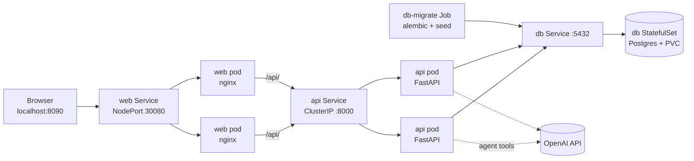

# AI Travel Concierge

A short-term rental app where guests can browse, book, and manage stays, or just ask an AI concierge to do it for them.

## Demo

*Using AI-Travel-Concierge to look up stays, get details on stays, book a stay, and update a reservation.*

https://github.com/user-attachments/assets/0567211e-7957-4c8a-ac6e-e12ba26c35c9

## Overview

AI Travel Concierge is a full-stack MVP that pairs a traditional booking UI with an LLM agent that can take real actions against the same backend.

**What it does**

- Browse and filter about two dozen seeded stays by city, price, guests, and dates
- View property details, house rules, and nearby restaurants and activities
- Book, extend, and cancel reservations, and report issues on a stay
- Chat with an AI concierge that searches stays, answers questions about a reservation, and makes booking changes by calling tools, with each tool call shown in the chat

**Components**

| Component | Tech | Role |
|-----------|------|------|
| Web | React + TypeScript (Vite), served by nginx | Browse/book/reservations UI and chat panel; proxies `/api` to the API |
| API | FastAPI + SQLAlchemy + Alembic | REST endpoints, business rules, and the AI agent |
| Agent | OpenAI Agents SDK | Tool-calling concierge wired to the API's service layer |
| Database | PostgreSQL 16 | Properties, reservations, issues |
| Runtime | Docker Compose, Kubernetes (kind) | Compose for quick local runs; Kubernetes with replicated web and API |

**Goal.** Use AI-assisted development to speed up development of a real, end-to-end product with LLM tool calling, containerization, and Kubernetes. The whole project was planned, built, and iterated on with [Cursor](https://cursor.com), shipped as one reviewed pull request per block.

Scope is intentionally MVP: a single demo guest, with no auth, payments, or live maps data.

## AI Concierge (LLM API)

The concierge is an [OpenAI Agents SDK](https://openai.github.io/openai-agents-python/) agent (`gpt-4.1-mini` by default) exposed through `POST /chat`. It doesn't know anything about the catalog on its own. Every fact and every change comes from a tool.

**Tools** (`backend/app/agent/tools.py`)

| Tool | What it does |
|------|--------------|
| `search_properties` | Filter stays by city, max price, guests, and availability |
| `get_property` | Full details for one stay |
| `get_house_rules` | Rules for the current reservation |
| `suggest_nearby` | Seeded restaurants and activities near a stay |
| `list_reservations` | The guest's reservations |
| `book_reservation` | Create a booking |
| `extend_stay` | Move check-out later |
| `cancel_reservation` | Cancel a confirmed stay |
| `report_issue` | File an issue against a stay |

**How a chat turn works**

1. The chat panel sends the full conversation, plus an optional `reservation_id` when opened from a reservation ("my stay").
2. The API runs the agent with a system prompt that forbids inventing properties, prices, or reservations and requires tools for facts and changes.
3. The agent calls tools (up to 8 turns). Each tool calls the same service functions the REST API uses, so validation and availability rules can't be bypassed.
4. The response returns the assistant's message plus **tool traces**, which the UI shows as `tool used: search_properties — city='Austin' max_price=200 …`, making the agent's behavior visible and easy to trust.

Example prompts: "quiet loft in Austin under $200 for 2", "what are the house rules for my stay?", "extend my stay by 2 nights".

**Failure handling.** A missing `OPENAI_API_KEY`, a rejected key, exhausted credits, or rate limits come back as clear `422` messages in the chat instead of a generic 500. Tool errors (for example, "Those dates are already booked") go back to the model as text so it can explain them to the guest.

## Kubernetes Architecture

The app runs on a local [kind](https://kind.sigs.k8s.io/) cluster with **2 web replicas** and **2 API replicas** behind Services. That's more than the app needs; the point was practicing real Kubernetes patterns.



The browser only talks to nginx. nginx serves the React build and forwards `/api/*` to the `api` Service, which load-balances across API pods.

| Object | File | Purpose |
|--------|------|---------|
| Namespace `travel` | `k8s/namespace.yaml` | Everything lives here; easy to reset |
| ConfigMap + `db-credentials` Secret | `k8s/config.yaml` | App config and demo DB credentials |
| `api-secrets` Secret | created by `make k8s-secret` | `OPENAI_API_KEY` from `.env`, never committed |
| Postgres StatefulSet + PVC | `k8s/postgres.yaml` | One replica with a persistent volume |
| API Deployment ×2 + `api` Service | `k8s/api.yaml` | Liveness/readiness probes, zero-downtime rolling updates |
| Web Deployment ×2 + NodePort Service | `k8s/web.yaml` | Exposed on host port **8090** |
| `db-migrate` Job | `k8s/jobs/db-migrate.yaml` | Runs migrations and seed once per deploy |

## Design Decisions

- **Agent tools reuse the service layer.** The LLM goes through the same validation and availability checks as the REST API, rather than having its own SQL or business logic.
- **Tool traces over a black box.** Returning which tools ran makes the agent debuggable and shows guests (and reviewers) that answers come from real data.
- **Stateless chat.** The client sends the conversation each turn, so any API replica can handle any request with no session store.
- **Double booking is prevented by the database.** An app-level availability check is a check-then-insert race once there are multiple replicas. A Postgres exclusion constraint on property and date range is the real guarantee, and violations map to `409 Conflict`.
- **Separate liveness and readiness.** `/health/live` never touches Postgres, so a database outage marks API pods unready (no traffic) instead of restart-looping them. `/health/ready` returns `503` when the database is down.
- **Migrations as a Job.** Running `alembic upgrade` on every API pod's startup would race across replicas, so it runs once as a Kubernetes Job.

## How I Built It with Cursor

I used Cursor as a pair programmer across the whole project, with a deliberate workflow rather than one-shot generation:

- **Plan before code.** Each block started in Plan/Ask mode: scope, "done when" criteria, what's explicitly out of scope, and a time box.
- **One block per branch and PR.** Agent mode implemented one block at a time. I reviewed each diff, ran the app and tests, and merged it as its own pull request:
  - [#1](https://github.com/walkerowen28/AI-Travel-Concierge/pull/1) API and web containers
  - [#2](https://github.com/walkerowen28/AI-Travel-Concierge/pull/2) Domain model, migrations, seed data, REST API
  - [#3](https://github.com/walkerowen28/AI-Travel-Concierge/pull/3) Browse, book, and reservations UI
  - [#4](https://github.com/walkerowen28/AI-Travel-Concierge/pull/4) AI concierge agent and chat panel
  - [#5](https://github.com/walkerowen28/AI-Travel-Concierge/pull/5) Local Kubernetes with replicated web and API
- **Ask mode to learn, not just ship.** I used it to understand tradeoffs as they came up: sync vs async endpoints, how requests flow through nginx and Services, and liveness vs readiness probes.
- **Debugging with evidence.** Real issues were diagnosed from logs and container state rather than guessed at. For example, a chat `422` turned out to be a stale container missing the API key, followed by an exhausted-credits error that led to clearer error mapping. A Kubernetes version incompatibility traced back to cgroup v1 on an older Docker Desktop.
- **Tests that don't burn credits.** Agent tests mock the model and exercise tools against a real database, so the suite runs without an OpenAI key.

## Getting Started

### Prerequisites

- [Docker](https://docs.docker.com/get-docker/) with about 2 GB of memory
- For Kubernetes: [kind](https://kind.sigs.k8s.io/docs/user/quick-start/#installation) (`brew install kind`), `kubectl`, and `make`
- Optional: an [OpenAI API key](https://platform.openai.com/api-keys) with credits. Everything except chat works without one.

```bash
git clone https://github.com/walkerowen28/AI-Travel-Concierge.git
cd AI-Travel-Concierge
cp .env.example .env    # then set OPENAI_API_KEY=... to enable chat
```

```bash
make k8s-tools   # optional: downloads a matching kubectl into ./.bin if you don't have one
make k8s-up      # create cluster, build + load images, apply manifests, migrate + seed
```

Open http://localhost:8090. Run `make k8s-down` to delete the cluster.

If you change `OPENAI_API_KEY` later, run `make k8s-secret && make k8s-redeploy`.

### Tests

With Postgres running and migrated (see above):

```bash
cd backend && uv run pytest
```

The suite covers domain rules (booking, overlap, extend, cancel, issues), agent tools with the model mocked, health probes, and the database-level double-booking guard.
