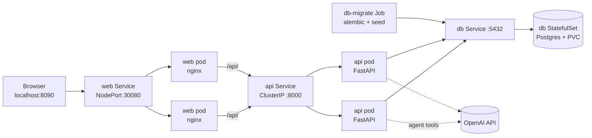

# AI Travel Concierge

AI-assisted travel stay browser and booking concierge (MVP learning project).

## Architecture

Three processes, each its own container. That is the shape a later Kubernetes cluster would use: one Deployment per service, an Ingress in front of `web`, and Postgres either in-cluster or a managed database.

| Piece | Image | Role | Host port |
|-------|-------|------|-----------|
| Database | `postgres:16` | Persistent data | **5432** |
| API | `backend/Dockerfile` (FastAPI + Uvicorn) | JSON API (`/health`, later booking + chat) | **8000** |
| Web | `frontend/Dockerfile` (built React app served by nginx) | Browser UI. nginx proxies `/api` to the `api` service | **8080** |

FastAPI is the API framework; Uvicorn is the HTTP server inside the API container. The React UI is a built static site, not Vite's dev server, so the web container does not need Node at runtime.

The browser always calls `/api/...`. Local Vite and container nginx both strip that prefix before FastAPI sees the path (`/api/health` becomes `/health`).

## Prerequisites

Docker. For hot-reload development on the host you also need Python 3.11+, Node 20+, and [`uv`](https://docs.astral.sh/uv/).

```bash
export PATH="$PWD/.venv/bin:$(brew --prefix node@20)/bin:$PATH"
cp .env.example .env
```

## Full stack in containers

Stop any host process already bound to ports 8000 or 5173, then:

```bash
docker compose up -d --build
```

- UI: http://localhost:8080
- API: http://localhost:8000/health
- UI → API: http://localhost:8080/api/health

```bash
docker compose down          # stop containers
docker compose down -v       # also delete Postgres data
```

## Host dev (hot reload)

Use this when you are changing code. Only Postgres stays in Docker.

```bash
docker compose up -d db

# terminal 2
cd backend && uv sync --group dev && uv run uvicorn app.main:app --reload --port 8000

# terminal 3
cd frontend && npm install && npm run dev
```

| Piece | Shutdown |
|-------|----------|
| Frontend | `Ctrl+C` in the `npm run dev` terminal |
| Backend | `Ctrl+C` in the `uvicorn` terminal |
| Database | `docker compose stop db` |

- Health: http://localhost:8000/health
- UI: http://localhost:5173
- Vite proxy: `/api` on **5173** forwards to FastAPI on **8000**

Do not run host Uvicorn and the `api` container at the same time. Both want port 8000.

## Domain data

From `backend/`, with Postgres running:

```bash
uv sync --group dev
uv run alembic upgrade head
uv run python -m app.seed
```

That loads demo guest Alex (`user id` 1), about two dozen properties, and one upcoming reservation. Seed skips itself if properties already exist.

### UI (Block 2)

| Route | What it does |
|-------|----------------|
| `/` | Browse + filters |
| `/properties/:id` | Detail, house rules, nearby, book form |
| `/reservations` | Cancel, extend, report issue |

- Vite: http://localhost:5173
- Container web: http://localhost:8080
- API docs: http://localhost:8000/docs

If the API is the Compose container, rebuild it after backend changes: `docker compose up -d --build api`. Rebuild the web image after frontend changes: `docker compose up -d --build web`. Migrations still run from the host against the published Postgres port.

### AI Concierge (Block 3)

Set `OPENAI_API_KEY` in `.env`, then restart the API (host or `docker compose up -d --build api`).

- Chat endpoint: `POST /chat` with `{ "messages": [{ "role": "user", "content": "..." }], "reservation_id": 1 }`
- UI: floating **AI Concierge** button on every page; tool traces show as `tool used: search_properties`
- On Reservations, **Chat about this stay** sets `?reservation_id=` context for house rules / nearby / extend

Example prompts:
- “quiet loft in Austin under $200 for 2”
- “what are the house rules for my stay?”
- “what’s nearby for dinner?”
- “extend my stay by 2 nights” (with a reservation context)

## Local Kubernetes (Block 4)

The same images run on a local [kind](https://kind.sigs.k8s.io/) cluster with **2 web** and **2 API** replicas behind Services. This is deliberately more than the app needs; the point is practicing Deployments, Services, probes, Secrets, Jobs, and rollouts. Compose stays the fast dev loop.



| Object | File | Why |
|--------|------|-----|
| Namespace `travel` | `k8s/namespace.yaml` | `kind delete cluster` or `kubectl delete ns travel` resets everything |
| ConfigMap + demo `db-credentials` Secret | `k8s/config.yaml` | Non-secret config and the Compose-equivalent DB password |
| `api-secrets` Secret | created by `make k8s-secret` | `OPENAI_API_KEY` from `.env`; never committed |
| Postgres StatefulSet + PVC | `k8s/postgres.yaml` | One replica with a stable volume; Postgres is not scaled |
| API Deployment ×2 + Service `api` | `k8s/api.yaml` | Service name matches `proxy_pass http://api:8000/` in `nginx.conf` |
| Web Deployment ×2 + NodePort Service | `k8s/web.yaml` | kind maps NodePort 30080 to host **8090** |
| `db-migrate` Job | `k8s/jobs/db-migrate.yaml` | Migrations and seed run once, not in each API replica |

### Prerequisites

Docker, `kind` (`brew install kind`), and a matching `kubectl`. `make k8s-tools` downloads kubectl 1.34 into `./.bin/`, which the Makefile prefers. The cluster pins Kubernetes 1.34 because 1.35+ will not start on Docker Desktop versions that still use cgroup v1.

Give Docker at least ~2 GB of memory. Compose and kind can run side by side (8080 vs 8090), but stop Compose if pods get OOM-killed.

### Commands

```bash
make k8s-up         # create cluster, build + load images, secret, apply, migrate, wait
make k8s-status     # pods, services, jobs, volumes
make k8s-lb         # 8 requests showing which web and api pod answered
make k8s-redeploy   # after code changes: rebuild images, migrate, rolling restart
make k8s-logs       # recent logs from both api pods
make k8s-down       # delete the cluster (and its database)
```

- UI: http://localhost:8090
- API through nginx: http://localhost:8090/api/health

Changed `OPENAI_API_KEY` in `.env`? Run `make k8s-secret` and then `make k8s-redeploy` (env vars are read when a pod starts).

### Things to try

- **Load balancing:** `make k8s-lb`. The `X-Web-Pod` header comes from nginx and `X-Api-Pod` from FastAPI (set via the Downward API `POD_NAME`).
- **Self-healing:** `.bin/kubectl --context kind-travel -n travel delete pod -l app=api --wait=false`, then `make k8s-status`. The Deployment recreates pods, and readiness keeps traffic off them until `/health/ready` passes.
- **Zero-downtime rollout:** run `make k8s-redeploy` while looping `make k8s-lb`. `maxUnavailable: 0` keeps both replicas serving during the restart.
- **Liveness vs readiness:** `/health/live` never touches Postgres, so a DB outage marks API pods unready instead of restart-looping them. Try `kubectl scale statefulset/db --replicas=0` and watch the api pods go `0/1` without restarting.

### Behavior changes for multiple replicas

- Double booking is blocked by a Postgres exclusion constraint (`reservations_no_overlap`). The app-level availability check alone is a check-then-insert race once two API pods (or two threads) book at the same time.
- `CORS_ORIGINS` is an env var (comma-separated) instead of a hardcoded list.
